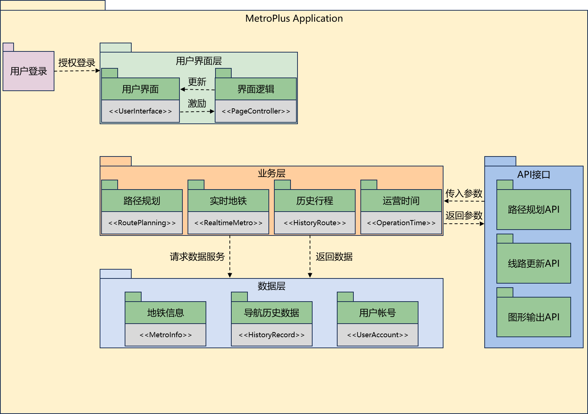
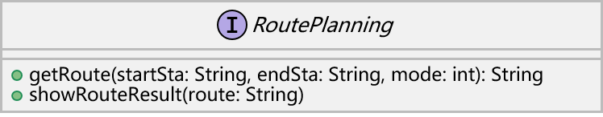
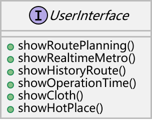
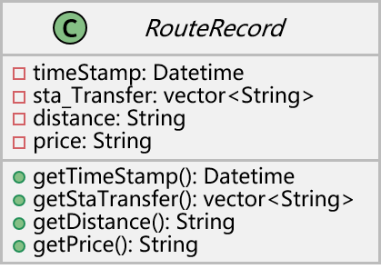
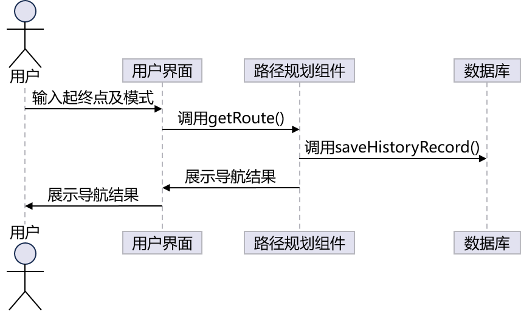
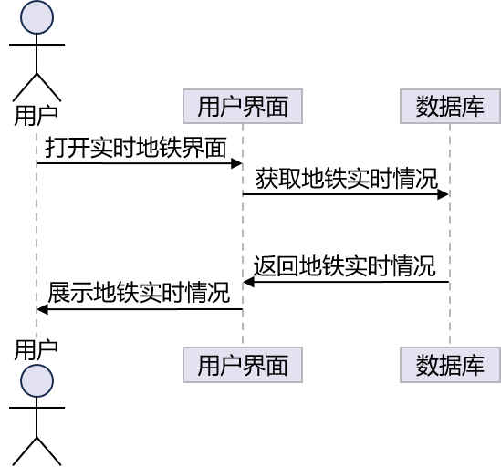
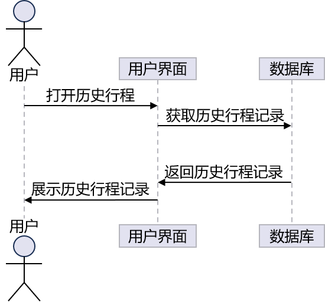

<h1 align="center">系统设计文档</h1>

## 一、系统分析 

MetroPlus桌面端应用采用分层架构的架构模式，架构示意图如下：

    

### 1.1 表示层（Presentation Layer）

表示层是用户与系统交互的界面，包括用户界面、数据输入、输出等。这一层主要负责将用户请求传递给下一层，并将处理结果返回给用户。在我们的地铁导航软件中，表示层包括路线规划、实时地铁、历史行程、运营时间的页面等，以及获取用户的帐号信息。

### 1.2 应用层（Application Layer） 

应用层是系统的核心层，它实现了地铁出行规划的核心算法和业务逻辑，包括文本处理、路径规划算法等。这一层主要负责接收并处理表示层传递的请求，然后调用其他层的服务，最后将处理结果返回给表示层。在我们的应用程序中，应用层负责：

1. 获取用户输入：手动输入
2. 获取输出结果：图形化输出

### 1.3 服务层（Service Layer） 

服务层为应用层提供支持，包括网络通信、数据访问、存储等服务。这一层主要负责处理数据的存储和访问。在我们的应用程序中，服务层可以包括调用路径规划接口获取导航结果、调取线路更新接口获取武汉地铁线路及站点信息、调取图形输出API对导航结果进行图形化展示等。

总的来说，以上三个层级构成了一个完整的地铁出行规划系统，每个层级都负责不同的功能，各司其职。这种分层架构模式使得系统更加清晰、易于扩展和维护。

## 二、组件设计

    

## 三、组件接口设计

### 3.1 数据库接口

    

- `saveHistoryRecord(record: HistoryRecord): void`：保存导航记录。
- `getHistoryRecord(): List<HistoryRecord>`：获取曾搜索的路线导航记录列表。

### 3.2 用户帐号接口

    

- `saveUserAccount(UserId: String, password: String, email: String)`：保存用户信息。
- `getUserAccount(): void`：获取用户信息。

### 3.3 路径规划接口

    

- `getRoute(startSta: String, endSta: String, mode: int): String `：输入起、终点及规划模式（如站点最少、距离最短等），获取地铁线路。
- `showRouteResult(route: String)`：将规划出的地铁线路字符串进行拆分处理，向用户图形化展示。

### 3.4 用户界面接口

    

- `showRoutePlanning(): void`：显示路径规划界面。
- `showRealtimeMetro(): void`：显示实时地铁界面。
- `showHistoryRoute(): void`：显示历史行程界面。
- `showOperationTime(): void`：显示运营时间界面。
- `showCloth(): void`：显示个性化主题界面。
- `showHotPlace(): void`：显示热门地点界面。

### 3.5 页面控制接口

    

- `+getToPage(page: String)`：表示该接口具有一个公共方法 `getToPage`，该方法接受一个参数 `page`，类型为 `String`，用于获取指定页面的内容。

### 3.6 路径记录类

    

- `timestamp: DateTime`：时间戳属性。
- `sta_Transfer: vector<String>`：换乘站点属性。
- `distance: String`：路程总长度属性。
- `price: String`：票价属性。
- `getTimestamp(): DateTime`: 获取时间戳。
- `getStaTransfer(): vector<String>`: 获取换乘站点。
- `getDistance(): String`: 获取路程总长度。
- `getPrice(): String`: 获取票价。

## 四、 系统流程分析

    

结合上述用例图，我们得出以下的时序图：

### 4.1 路径规划时序图

    

### 4.2 实时地铁时序图

    

### 4.3 历史行程时序图

    

### 4.4 运营时间时序图

    

